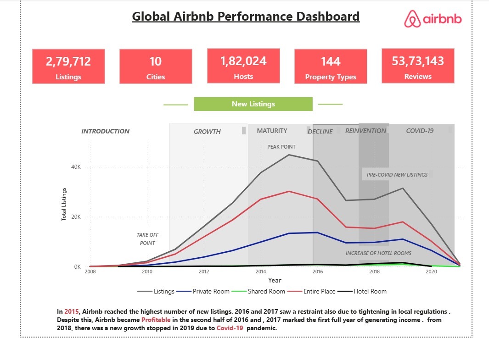
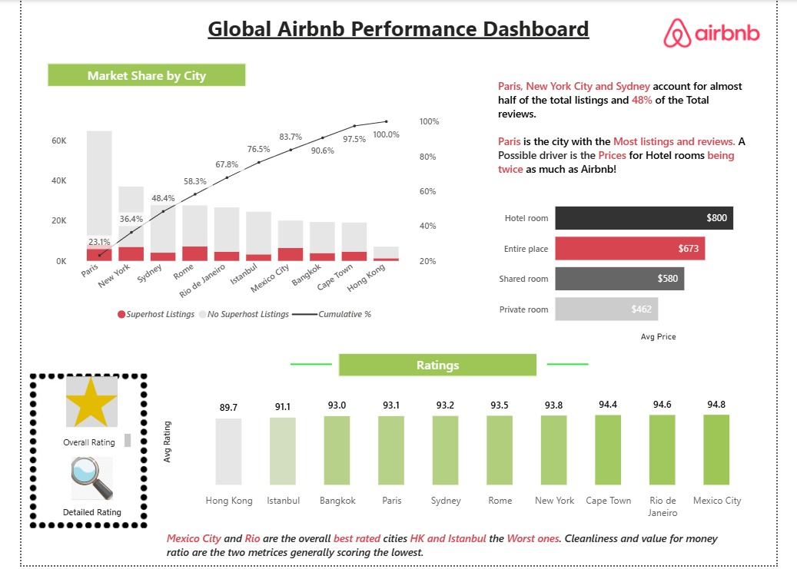
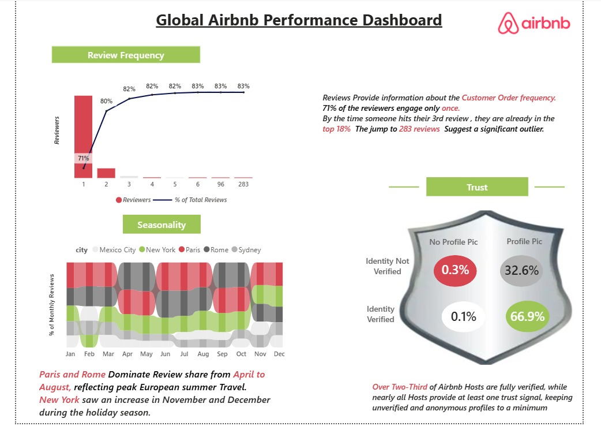

#  Airbnb Power BI Dashboard

##  Project Overview

This project presents an interactive **Power BI dashboard** analyzing Airbnb performance across multiple global cities. It highlights trends in listings, pricing, customer behavior, and platform trust.

---

##  Objectives

* Analyze growth trends of Airbnb listings
* Compare performance across major cities
* Understand pricing differences across property types
* Evaluate customer ratings and satisfaction
* Study review patterns and engagement
* Assess host verification and trust metrics

---

##  Tools & Technologies

* Power BI
* Data Visualization
* Data Cleaning

---

##  Dashboard Preview

### 🔹 Overview

### 🔹 Market & Ratings Analysis

### 🔹 Reviews & Trust Analysis

##  Key Insights

* Listings peaked around **2015** and declined during COVID-19
* Paris, New York, and Sydney dominate listings
* Hotel rooms are more expensive than Airbnb stays
* Mexico City and Rio have the highest ratings
* Majority of users engage within early reviews
* Over **66% of hosts are verified**, improving trust

---

##  Download Full Project

👉 [Download PBIX File](https://drive.google.com/file/d/1llZ1WX-nq6xAIV92anjPHBhb2gKVXOB1/view?usp=sharing)

---

##  How to Use

1. Download the `.pbix` file
2. Open it in Power BI Desktop
3. Explore different dashboard pages

---

##  Features

* Multi-page interactive dashboard
* KPI cards for quick insights
* Trend and time-series analysis
* City-level comparison
* Data storytelling approach

---

##  Author

**Sparsh Vats**

Aspiring Data Analyst
